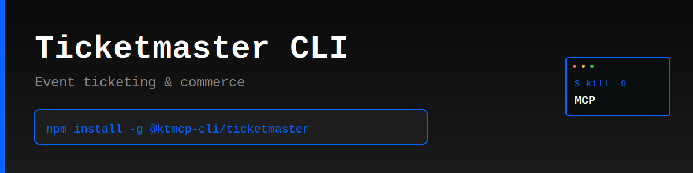

> "Six months ago, everyone was talking about MCPs. And I was like, screw MCPs. Every MCP would be better as a CLI."
>
> — [Peter Steinberger](https://twitter.com/steipete), Founder of OpenClaw
> [Watch on YouTube (~2:39:00)](https://www.youtube.com/@lexfridman) | [Lex Fridman Podcast #491](https://lexfridman.com/peter-steinberger/)

# Ticketmaster CLI

Production-ready command-line interface for the Ticketmaster Commerce API - access event ticketing and commerce data from your terminal.

> **⚠️ Unofficial CLI** - This tool is not officially sponsored by Ticketmaster. Use at your own risk. Always test in development before production use.

## Features

- 🎟️ **Event Offers** - Browse available offers and pricing for events
- 💰 **Pricing Details** - View detailed pricing with fees and taxes
- 🎫 **Ticket Limits** - Check min/max ticket quantities
- 🔐 **Password Access** - Handle password-protected offers
- 📊 **JSON Output** - Machine-readable output for automation
- ⚡ **Fast** - Lightweight, no bloat, just works

## Why CLI > MCP

- ✅ Works instantly - no server setup required
- ✅ Direct API access - no middleware overhead
- ✅ Composable with standard Unix tools (grep, jq, etc.)
- ✅ Perfect for automation and scripting
- ✅ Lower latency, simpler architecture

## Installation

```bash
npm install -g @ktmcp-cli/ticketmaster
```

## Quick Start

```bash
# Set your API key (required)
ticketmaster config set --api-key YOUR_API_KEY

# Get offers for an event
ticketmaster events offers G5vHZ9gMdcfPa

# JSON output for scripting
ticketmaster events offers G5vHZ9gMdcfPa --json | jq '.offers[0]'

# Show API info
ticketmaster info
```

## Commands

### Configuration

```bash
# Show current config
ticketmaster config show

# Set API key
ticketmaster config set --api-key YOUR_API_KEY

# Set custom API base URL (optional)
ticketmaster config set --base-url https://www.ticketmaster.com/commerce/v2
```

### Events

```bash
# Get event offers
ticketmaster events offers <eventId>

# Get event offers with JSON output
ticketmaster events offers <eventId> --json
```

### Information

```bash
# Show API information and limitations
ticketmaster info
```

## JSON Output

All commands support `--json` flag for machine-readable output:

```bash
ticketmaster events offers G5vHZ9gMdcfPa --json
```

## Use Cases

- **Event Ticketing** - Access real-time ticket availability and pricing
- **Price Comparison** - Compare prices across different offer types
- **Automation** - Integrate ticketing data into scripts and pipelines
- **Commerce Integration** - Build ticketing features into applications

## API Information

The Ticketmaster Commerce API v2 provides access to event offers and ticketing data.

**Important Notes:**
- API key required (obtain from [Ticketmaster Developer Portal](http://developer.ticketmaster.com/))
- Currently supports event offers lookup
- Transaction capabilities require approved access from Ticketmaster
- For event search/discovery, use the [Discovery API](https://developer.ticketmaster.com/products-and-docs/apis/discovery-api/v2/)

### API Reference

- **API Docs**: http://developer.ticketmaster.com/
- **Developer Portal**: http://developer.ticketmaster.com/support/contact-us/
- **Base URL**: https://www.ticketmaster.com/commerce/v2

## Example Response

```bash
$ ticketmaster events offers G5vHZ9gMdcfPa

Event Offers (3 found)

Offer 1:
  ID:           offer-1
  Name:         General Admission
  Type:         standard
  Description:  Standard admission ticket
  Currency:     USD
  Prices:
    - Floor: 99.50 (Total: 115.75)
    - Balcony: 59.50 (Total: 72.25)
  Limits:
    Min: 1
    Max: 8
  Availability:
    Start: 2026-01-15T10:00:00Z
    End: 2026-03-20T22:00:00Z

✓ Use --json flag for full details
```

## License

MIT © KTMCP

---

**KTMCP** - Kill The MCP. Because CLIs are better.


---

## Support KTMCP

If you find this CLI useful, we'd greatly appreciate your support! Share your experience on:
- Reddit
- Twitter/X
- Hacker News

**Incentive:** Users who can demonstrate that their support/advocacy helped advance KTMCP will have their feature requests and issues prioritized.

Just be mindful - these are real accounts and real communities. Authentic mentions and genuine recommendations go a long way!

## Support This Project

If you find this CLI useful, we'd appreciate support across Reddit, Twitter, Hacker News, or Moltbook. Please be mindful - these are real community accounts. Contributors who can demonstrate their support helped advance KTMCP will have their PRs and feature requests prioritized.
